# **Cat and Mouse**
Cat and Mouse is a desktop-only browser game where the user controls a mouse navigating through a level full of obstacles to get to a block of cheese. The mouse is being chased by a cat through the level which encourages the user to be strategic with each move they make. The user also has to reach the cheese before a time limit runs out. This encourages the user to make drastic decisions to reach the goal. The end result is a fast-paced tactical chase game.

This game idea arose from a previous experimentation project where I was attempting to make a Tetris clone. I ended up with a basic prototype of a grid game where you control a blue block that is being chased by a red block. This was a key inspiration for this project. The prototype is available [here.](https://github.com/steharr/js-prototype-chasing-game)

## **UX**
The **five planes of user experience design** developed by Jesse James Garrett was used as the conceptual framework for the development process of this site

### **Strategy Plane**
There were two perspectives I needed to take into account when planning out the strategy of my site. These perspectives would help me to create a list of user stories to use when designing the site. These perspectives were:

  * Site Owner Perspective = Game Developer
  
  * Site Viewer Perspective = 

For the perspective of ....
For the perspective of ....

### **User Stories**

#### Site Owner:

As as developer I want to...

1. Design a game I would enjoy playing
2. Design a game with a basic artificial intelligence
3. Create something that I can use in my portfolio
4. Design a game with some level of difficulty that requires strategic thinking
5. Design a game which is unique on each playthrough

#### Site Viewer:

As a user playing a game...

1. I want the base game mechanic to be satisfying
2. I want to be rewarded for progress
3. I want to have a challenge which I can overcome
4. I want the game graphics to be visually appealling
5. I want to enjoy playing the game
6. I want the controls to be responsive
7. I want multiple levels in the game

### **Scope Plane**

For the Scope plane, I first planned out the scope of the features I wanted to include. I then planned out key decisions for the game design so that I would be more focused on how I could achieve what I needed in the game. 

### **Planned Scope of Game Features**
In order to plan out the development process, I created a list of features which I wanted to implement. I split these features into two groups. One group was for features that would be needed for a minimum viable product. The second group was a list of features that would be a bonus to have, but were not top priority. My development strategy was to first get all minimum viable product features completed and then depending on the time I had left, I would target at least 2 or 3 features from the secondary group. These groups are listed here:

**Group 1: Minimum Viable Product**
|Feature|Description|Importance (1-10)|
|:--:|:--:|:--:|
|Level Generator|A generator to create a level on the game page|10|
|User Controlled Character|a character that can be controlled with arrow keys|10|
|Enemy Character with Basic AI|An enemy character that follows the user around the map|10|
|Chasing Mechanic|An organic and looming chase given by the cat to the user|10|
|Character Collision Detection|Characters can recognise obstacles around them|10|
|Competent Enemy AI|Enemy AI has the ability to act after detecting an obstacle|10|
|Multiple Level Layout|Level generator can make multiple levels|9|
|User Success Feedback|When the user gets the goal destination the game loop will terminate appropriately|8|
|Enemy Capture Feedback|When the users mouse character gets caught by the cat the game loop will terminate appropriately|8|
|Time Limit| A countdown to encourage the user to make drastic moves|8|
|Restart Button|User can restart a level at any point|8|
|Character Graphics|Visual animations/images for cat and mouse|8|
|Level Aesthetics|Visual layout of obstacles that mouse has to navigate|8|
|Difficulty Selection|User can choose how hard the game should be|8|
|Level Aesthetics|Visual layout of obstacles that mouse has to navigate|8|
|Winning Screen Modal|Success Modal|6|
|Losing Screen Modal|Failure Modal|6|

**Group 2: Secondary Features**
|Feature|Description|Importance (1-10)|
|:--:|:--:|:--:|
|Main Menu|A main menu for the user to initialise the game, also shows instructions on how to play |6|
|High Scores|Score calculation based on close evades with the cat|6|
|Advanced Enemy AI|Enemy Cat AI can calculate the nearest route to the goal destination and play defensively|6|
|Treacherous Level Obstacles|Mouse can get killed if he moves into certain obstacles |6|
|Sound Effects|Sounds for key moments in the game|6|
|Fetch Quests|Levels where Mouse has to retrieve item and return to base|5|
|Multiple Enemies|Multiple Cat enemies to evade|4|
|OOP - JS Classes|Seemlessly readable code with classes/objects|4|
|Multiple Device Compatible|Playable on Phone as well as desktop|3|
|Powerups|Enable mouse and/or cat to move more quickly through the level|2|
|Animated Avatars|Character assets show animated movement from block to block|1|

#### **Key Design Choices**

1. Game Grid  
I decided that each level should be composed of a series of cells which make up a grid. Each cell in the grid would have its own coordinate with an x-value and a y-value. This resulted in a game coordinate system which all functions in the game could use to make calculations. I wanted the ability to represent the grid as a two dimensional Array of numbers. One of the first things I planned to program was a 'game state' function to calculate this Array and fill it with codes indicating what was in each cell. This ended up begin called `createGridArray`. An example of how this could be used: If the value of cell (2,1) in the grid array was equal to 2, this meant the Cat was located in the cell with coordinates x=2, y=1. These coordinates could then be compared with the coordinates of the Mouse by the Cat AI in order to make decisions.

2. Game Graphics  
I had been doing some reseacrh on how Javascript games are made and one option for the game graphics I saw was to use the javascript **CanvasAPI**. I decided against this because I was new to Javascript and felt that I could more easily achieve the results I needed with vanilla Javascript DOM manipulation. I thought that in order to understand it fully, the **CanvasAPI** would require a certain amount of time I didnt have. The game graphics therefore ended up being `div` elements with background colors and images. Each `div` element had a data attributes for x and y coordinates.

3. Level Generation  
I wanted the level generation to be varied and organic. In order to achieve this I decided that the level generator would be semi random. I decided to create a generator that randomly placed obstacles on the level according to inputted difficulty variables. During the testing stages of the project, I would then create rules for the generator in order to combat potential issues that could arise from random level generation. i.e. levels where the user starts in a obscured position would need to be addressed.

4. Movement Mechanics  
I decied that movement was only possible in the x and y direction in order to keep the progrmming as simple as possible. The characters would only be able to move one cell along these axes at a time. 

5. Enemy AI  
I decided that enemy movement would only occur once the user moved their character i.e. the cat would not make a move unless the user had made a move themselves. This was partially a technically decision; it would be alot easier for me to program the game events this way. It also could be argued that stylistically this matched with the game; cats stalk their prey and pounce on them when they make a movement.

### **Structure Plane**
For the structure plane, I used my user stories and my scope plane feature list to help me plan out the structure of the site. 

I decided that the game graphics would be housed in a game console element which also stored information on user scores, difficulty and time limit. I also decided to add directional buttons into the game console to give visual feedback to the user about what direction they were directing the mouse to move in. Implementing directional buttons like this for the first release would also make it easier later on to design the game for smaller screens. 

For the overall structure of the site, I planned for two pages in total. The landing page welcomes the user to the site and explains the rules of the game. The landing page would lead the user into the main game pages where they could play.

#### Site Structure:

##### **Generic Site Elements** 
* *Header*    
The header of the site contains the title of the game and a Github link to the repository over to the right side.

* *Footer*  
The footer contains a simple copyright watermark

##### **Landing Page (Main Menu)**
* *Main Menu*    
A centered main menu block greets the user as they enter the site. The main menu details the control system of the game and gives a demonstration of the game in action. I initally thought I would implement an image to give a demonstration of the game. Over the course of the project this evolved to using a moving gif which showed gameplay. Finally, the main menu also includes a button to go to the game screen.

##### **Game Page**

* *Main Game Console*  
The game console houses the graphical display of the game and other key information for the user

* *Game Grid*  
The game grid depicits the level containing the characters of the game. The grid contains a number of cells, some of which have obstacles. There is a 'success' grid for the cheese. The cat and mouse characters move along the cells without any obstacles.

* *Side Game Console*  
At the side of the main game console, information for the user is on display. This includes a time limit and a score counter. There is a directional arrows which give feedback on the user moves. At the top right of the console, there is a button for restarting a level and a button to take the user back to the main menu.  
  
### **Skeleton Plane**
The majority of this project was focused on developing internal game logic and DOM manipulation systems. Therefore, for the skeleton plane, I felt I only needed to focus on creating a basic schematic of game console before I began coding. The only wireframe I created was for the game console layout.

I was clear in my mind about how the game was going to be arranged on the page. The other elements of the site such as the main menu could be easily created late in the development process because they were purely functional and did not require a high amount of effort.

I also created a wireframes for how the game could look on smaller screen devices such as iPad and Phone. These were not used in the end as I did not have enough time to make the game compatable on these devices.

#### Wireframes:

* [Game Console Layout](assets/documents/wireframes/game-console-layout.png)
* [Game Console Layout - Smaller Devices](assets/documents/wireframes/game-console-layout-smaller-devices.png)

### **Surface Plane**

As mentioned previously, the idea for the game originated from a basic [chasing game prototype](https://github.com/steharr/js-prototype-chasing-game) I had made previously when practising Javascript in preparation for this project. As a result of this, I didnt work on the surface plane until I had fleshed out the key game chasing mechanics. 

#### Game Aesthetic

Once I had the base game mechanics developed, I then started to work on the aesthetic of the game. I researched common 'chasing' archetypes in popular media. I had many different ideas (e.g. Cowboys chasing Indians, Police chasing Criminals, the Predator chasing Schwarzenegger). The idea that made the most sense in terms of the feel of how the game played was **cats chasing mice**. I was particularly inspired by the famous Tom and Jerry cartoon. The game always felt most enjoyable when you were being closely followed by the enemy which was similar in fashion to the close chases of that cartoon. 

Once I had the idea that the game characters were to be a cat and mouse, I then decided on the aesthetics of the game levels. Since the game showed an overhead viewpoint, I wanted the color of the board to be vibrant. I decided the game would be set in a garden and the game floor would be grass.

#### Game Assets
* *Game Floor Texture*  
For the game floor, I used a stock image of a grass texture from [freestocktextures.com](https://freestocktextures.com/texture/green-grass-background-2,944.html). In order to make sure it would not distract from the game characters, I pixelated and reduced focus on the image using [Canva](https://www.canva.com/)
* *Cat Character*  
For the Cat, I used two moving gifs from [animatedimages.org](https://www.animatedimages.org/)
* *Mouse Character*  
For the Mouse, I used two moving gifs from [animatedimages.org](https://www.animatedimages.org/)  
* *Obstacle*  
The barrel obstacle was created using an image available from [Canva](https://www.canva.com/)

#### Colour Palette
In order to choose an overall colour palette for the pages I used the colour scheme generator site [Coolors](https://coolors.co/). The color palette was generated using the color of the grass texture as input. I chose a collection of colors which worked best with the green color.

#### Font
* The font of the site is [Otomanopee One](https://fonts.google.com/specimen/Otomanopee+One?query=Otomanopee+One)

***
## Features
### Existing Features
|Feature|Description|Location|
|:--:|:--:| :--:|

### Features Left to Implement

## Technologies Used

* [Visual Studio Code](https://code.visualstudio.com/)  
Code editor I used to write my code
* [Live Server VS Code Extension](https://marketplace.visualstudio.com/items?itemName=ritwickdey.LiveServer)  
Extension I used to see in real time the effect that the changes I was making to my code would have
* [HTML](https://en.wikipedia.org/wiki/HTML5)  
For markup
* [CSS](https://en.wikipedia.org/wiki/CSS)  
For styling the site
* [Boostrap Framework](https://getbootstrap.com/)  
I used the bootstrap grid system to help me design responsive layouts and I made customized versions of various boostrap components throughout the page
* [Google Fonts](https://fonts.google.com/)  
For the font used in the site
* [Font Awesome](https://fontawesome.com/)  
Used for icons throughout the site
* [Git](https://git-scm.com/)  
For version control
* [GitHub](https://github.com/)  
For storing my files and for hosting the site on Github Pages
* [Canva](https://www.canva.com/)  
I used a premium version of this tool to create various images throughout the site, most notably the project card images
* [favicon-generator.org](https://www.favicon-generator.org/)  
Used to generate a favicon for the site from an image I created using Canva
* [resizeimage.net](https://resizeimage.net/)  
Used to resize images on the page to improve Lighthouse scores
* [placeholder.com](https://placeholder.com/)  
I used this site to create small blocks of colour for the colour palette section of this README
* [Balsamiq](https://balsamiq.com/  
Used to create wireframes
***

## Testing

### **Notable Bugs Occurring During Development**
During the development phase of the site, I encountered a number of significant bugs while testing the output of my code. They were all mistakes which led to important lessons learned for future projects. These are documented below:
#### **Game Characters Starting in Obscured Positions**
Due to the randomness of the level generator, I was encountering a bug where the characters spawned in positions where they couldnt move due to obstacles surrounding them. This was inevitably going to happen with any random level generation. To correct this issue, I created a `checkForAwkwardLevel` function which checks the surrounding blocks of each character and returns a boolean based on whether a character is obscured. This function is then fired whenever a new level is generated. If the function returns true then the page is reloaded so that a new level is generated again.

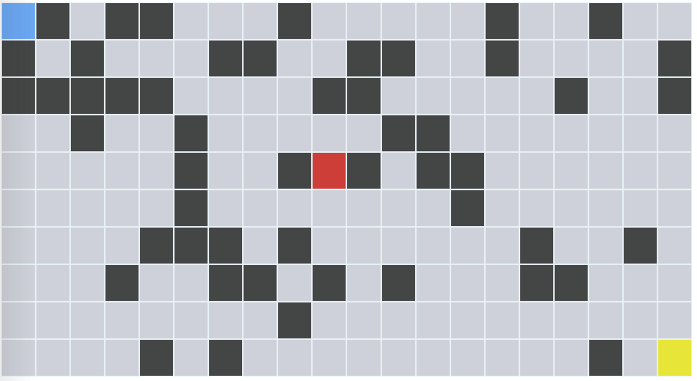  

   *-The picture above is from early on in development before the game graphics were added. The mouse is represented by a blue square and can be seen to be obscured by grey obstacle blocks*

#### **Challenges Refining Cat AI Decision Making**
When working on the Cat AI, I encountered an issue where the Cat was choosing to move in a disadvantagous manner when he encountered an obstacle.
If the Cat was blocked from moving along a particular axis, he would wrongly prioritise moving in a specific direction along the opposite axis e.g if the cat was blocked in the x direction, he would always take the option of going up on the y axis, even if going down was a better decision.

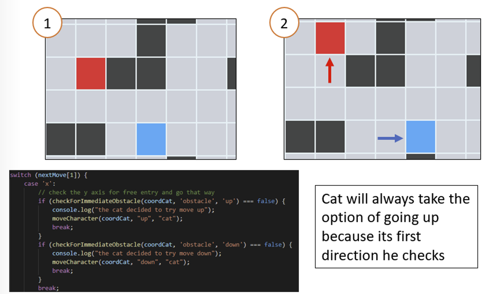 

To correct this issue, I refactored the Cat AI and introduced logic which took into account the position of the Mouse so that the Cat would make better decisions.

#### **Countdown Timer Speeding Up Bug**
When I initially implemented the countdown timer on the game page, I encountered a bug while testing where the timer would speed up each time the user died or restarted a level. The timer was constructed using a `setInterval` method. Whenever the user died or chose to restart a level, the page wasnt reloaded and therefore the interval was not cleared. In order to correct this issue, I stored the ID of the interval in a global variable called `timerInterval`. Whenever the game needed to be restarted or the user dies, the game will then clear the interval function that has this global ID variable using `clearInterval(timerInterval)`

#### **Distance Calculation Function Not Consistent**
In order to improve the Cat AI, I adjusted my `calculateDistance` function so that it could calculate the distance between two points along a specified axis. I used an if statement to calculate what coordinates need to be used for the required input. e.g. if the specified axis was equal to x, then only the x coodinates of each point needed to be used by the function. Originally this if statement contained two equal symbols in its syntax e.g. **(specifiedAxis == 'x')**. This was providing me unreliable results. I therefore changed the operator to a strict equals operator to correct this issue. 

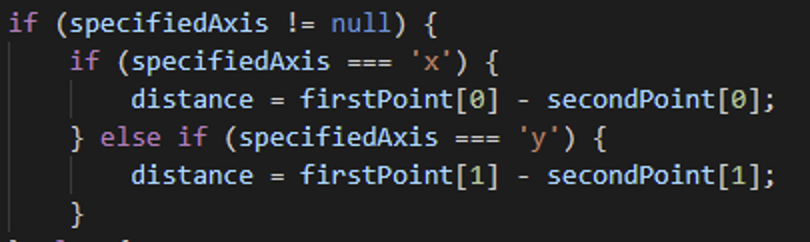 

### Javascript Validator Results
In order to validate the quality of my Javascript Code, I passed it through the [Jshint linter](https://jshint.com/) to ensure there were no major issues.

When passed into the linter i received no error messages and 13 warnings. In the 13 warnings there were three warning types. Below details how these warnings were adressed:

* *Missing Semicolon*    

   These were missed during development and were simple to fix. Since this was my first time coding a major Javascript project, it was inevitable that I would miss out on some semicolons.

* *Don't use extra leading zeros '00'*  

   The objective of the function 'zeroScore' is to set the visible score on the scoreboard to zero. When coding, I had inputted the code to set the text content of the element to equal a value with a leading zero. To fix this warning, I removed the leading zero.

* *Functions declared within loops referencing an outer scoped variable may lead to confusing semantics. (gridRow)* 

   The objective of the function 'createGridArray' is to create a two dimensional array describing the game state of the level. The function has to first loop through each **row** of the game grid and then loop through each game **cell** in order to obtain the required information. 
   Due to the complexity of this function, I decided to use a **for...of** loop when looping through the rows in order to made the code appear more readable than if I was to use an i iterator. From my perspective, using **"for (let row of rows)"** was more easily understandable than **"for (let i = 0; i < rows.length; i++)"** as it explains clearly that the computer is working through each row in this loop. 

   As a result of this decision, I had to use some slightly complex syntax when looping through the game grid **cells**. The **.forEach** method I used resulted in a callback function being used inside my original for loop. This is why the linter highlighted this warning to me. To improve the semantics, I changed the syntax for the **.forEach** loop from a callback function syntax to a arrow function syntax. Previously it was **".forEach(function (cell) .."** and I changed it to **".forEach((cell) .."**. Even though this did not remove the warning from the linter, I felt it was sufficient to make the code easier to understand as **".forEach((cell) .."** makes it more clear that the computer is working through each cell.

### HTML Validator Results
In order to validate the quality of my CSS Code, I passed it through the [W3C HTML Validator](https://validator.w3.org/) for both pages of my site to ensure there were no major issues. The only error message I got was linked to the **game.html** page of the site

#### Error Messages

*Bad Value Error*
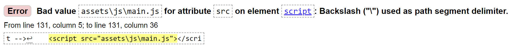  
This error was caused by a `script` element I was using in the game.html page of the site. The element contained backslash characters which I changed to forward slashes to correct this error.

### HTML Validator Final Results
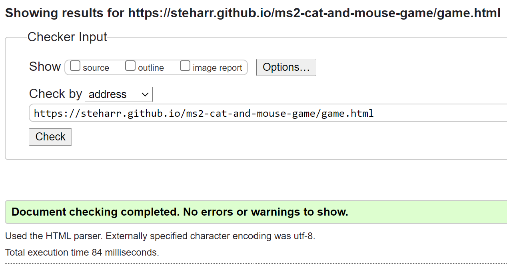
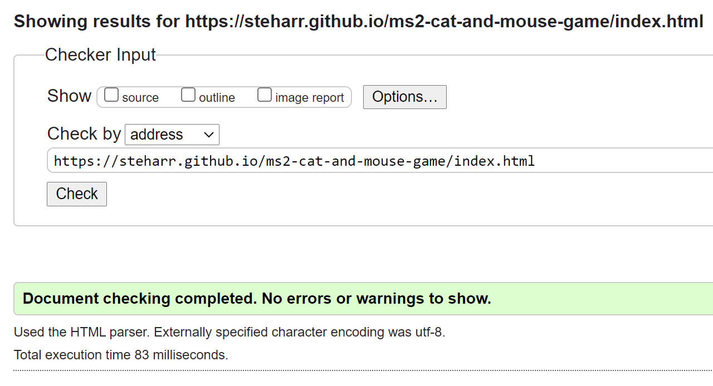

### CSS Validator
In order to validate the quality of my CSS Code, I passed it through the [W3C CSS Validator](https://jigsaw.w3.org/css-validator/) to ensure there were no major issues. After the first time passing it through the validator, I noticed there were errors and warnings linked to external Bootstrap files. I had included Bootstrap early on in my project in order to help me quickly put together the game console. As the project progressed, I was using more custom CSS in order to achieve the results I needed. Eventually, my project was not significantly enhanced by the inclusion of Bootstrap so I decided to remove it once I saw the CSS validation errors/warnings that were coming from it. The second time I passed my code I recieved the following errors and warnings:

#### Errors

*Not Found Error*
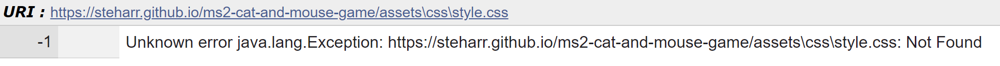  
This error was caused by a `link` element I was using in the index.html page of the site. The element contained backslash characters which I changed to forward slashes to correct this error.

#### Warnings

*Unknown Vendor Extensions*
My site used FontAwesome for various icons throughout the site. These warnings were linked to multiple vendor prefixes by FontAwesome used in order to ensure compatibility across different browsers. From researching this validator warning online, I understood that these vendor extensions are outside of the scope of the validator since they are proprietary code. 

### CSS Validator Final Result
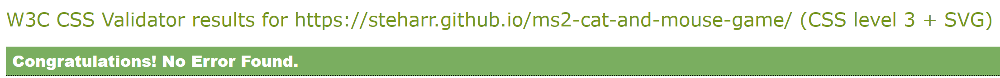

### Lighthouse
To analyse the Performance, Accessibility and User Experience of my site, I used [Lighthouse](https://developers.google.com/web/tools/lighthouse) in Chrome developer tools.

#### Results
**Main Menu Page** 

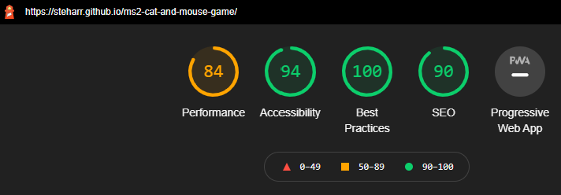

* Performance of Main Menu Page  
   The performance score of the page was not perfect, however due to time constraints I was not able to improve it. For future releases, I would improve this score by replacing the *How to Play* gif image with a more efficient filetype for animations such as MPEG4
 
**Game Page**  

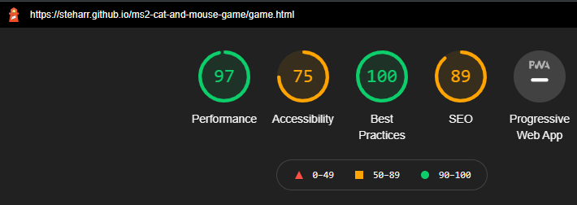

* Improving Accessibilty Score for Game Page  
   The results from the Lighthouse tool for accessibilty showed that the buttons on the side game console of the page did not have accessible names. In order to address this I gave each button element an `aria-label` attribute to clearly describe the action of the button.
   The results also showed that the links on the side game console and Navbar did not have discernible names. In order to address this I also gave these elements an `aria-label` attribute. The final result after these changes are below:

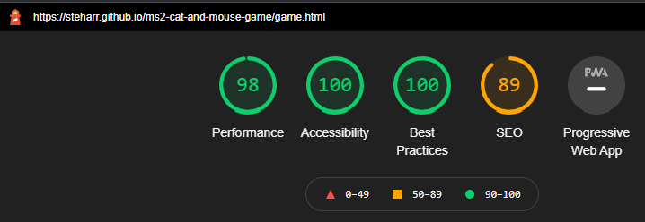

### User Stories Validation

#### Site Owner:
1. *As as developer I want to design a game I would enjoy playing*  
   I thoroughly enjoy playing the game. I find the main game loop very addicting. I often found myself getting lost in gameplay while I was carrying out testing.

2. *As as developer I want to design a game with a basic artificial intelligence*  
   The enemy cat character has a basic artificial intelligence that responds to the users moves. This creates thrilling in-game chases. The cat has two layers of decision making which can be seen in the `activateEnemyAI` function of the **main.js** file. The cat first checks its distance to the mouse in the x and y axis. Whichever axis is larger, the cat will attempt to move. If this attempt is blocked by an obstacle then the cat carries out the second layer of decision making. This involves taking the axis of the initial attempted move and checking the opposite axis i.e. if the cat was blocked in x direction, the cat then checks the y axis for free paths.

3. *As as developer I want to create something that I can use in my portfolio*  
   This project has a high level of complexity and therefore is definately something I would include in my portfolio

4. *As as developer I want to design a game with some level of difficulty that requires strategic thinking*
   The game is challenging as the user has to outwit an advancing enemy character. There is multiple strategies which can be used depending on the level layout.

5. *As as developer I want to design a game which is unique on each playthrough*  
   This is achieved through the randomness of the in-game level generator. It is also achieved by the organic artificial intelligence of the cat which varies depending on the position of the users character.

#### Site Viewer:
1. *As a user playing a game I want the base game mechanic to be satisfying*  
   The base game chasing mechanic is very satisfying due to the intelligence of the cat. The cat character is quite menancing (particularly at the hard difficulty) due to the responsive nature of its movements. The user also is put under presssure due to the inclusion of a time limit. The combination of these two elements gives the user an adrenaline rush as they are playing the game.

2. *As a user playing a game I want to be rewarded for progress*   
   This story is satisfied by the inclusion of a score counter. The users score is calculated as they navigate through the level. The scoring system rewards moves that are in close proximity with the cat in order to encourage risk taking gameplay. If the user is successful in reaching the end game, they are also given statistics detailing how close they were to the cat.

   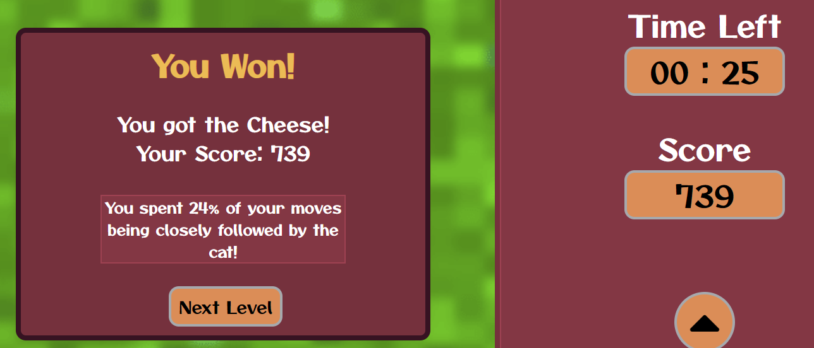

3. *As a user playing a game I want to have a challenge which I can overcome*  
   I have tested the game with multiple friends and family. It is possible to complete all three difficulty levels of the game. Each presents a challenge for the user.

4. *As a user playing a game I want the game graphics to be visually appealling*   
   The colors of the game are deliberately chosen to be vibrant in order to make the experience of playing more enjoyable. The gifs used for the various assets of the game make the game board feel dynamic.

   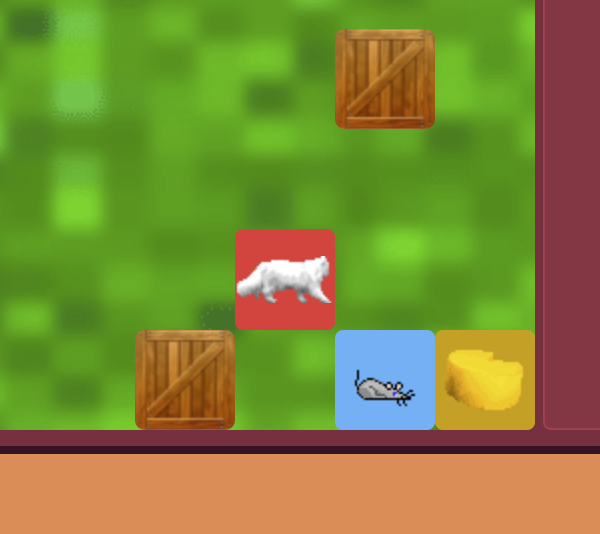

5. *As a user playing a game I want to enjoy playing the game*   
From testing the game with friends and family and through playing the game myself as a user, I can conclude that it is an enjoyable game.

6. *As a user playing a game I want the controls to be responsive*  
The controls of the game are responsive. During testing I received no complaints about unresponsive movements. There are visual directional buttons included in the side game console which light up when buttons are pressed. This gives the user additional feedback about their movements when playing the game.

   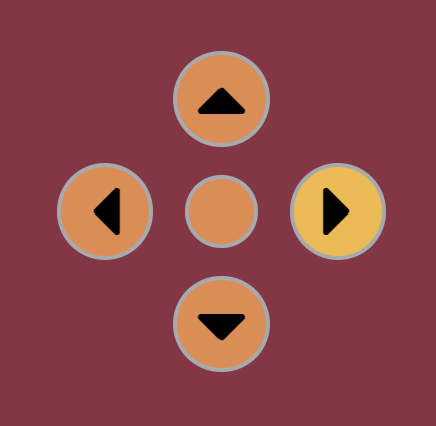

7. *As a user playing a game I want multiple levels in the game*  
   Multiple difficulty levels exist in the game. Due to the randomness of the level generator, no two level layouts are the same.

   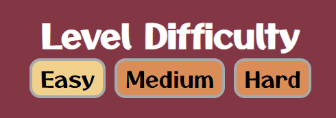 

***

## Version Control
* To begin the project I created a remote repository on Github by choosing the **New Repository** button and following the on screen steps.
* I then created a local repository using Git:
   *  I created a directory on my computer called **template**
   *  I opened the directory using VS code and started a terminal
   *  I initialized the directory as a Git repository using the command `git init`
   *  I added a README to the file using the command `git add README.md`
   *  I then created an index.html file in the directory and started working on the site
   *  When I was ready to commit my first set of changes, I used the `git add .` and the `git commit -m "Initial commit"` commands in my terminal
   
* In order to store my commits remotely on Github, I linked my local repository to the remote repository:
   * In my VS code terminal, I used the command `git remote add origin https://github.com/steharr/` and `git remote -v`

* Throughout the development process, I would regularly push my commits to Github using the `git push` command 

## Deployment
* The website has been deployed using Github pages. In order to do this, I followed the steps given in the GitHub docs page on [Configuring a publishing source for your GitHub Pages site](https://docs.github.com/en/pages/getting-started-with-github-pages/configuring-a-publishing-source-for-your-github-pages-site):

   * In the repository, select **Settings**
   * Select the **Pages** tab
   * Select **main** as the publishing source, using the Branch drop down menu

***
## Credits

### Code

### Content
All written content was created by me

### Media

* Images

### Acknowledgements

* My mentor, **Spencer Barriball** who guided me through this project.
* Fellow **Code Institute** students on Slack who helped troubleshoot issues and give me inspiration for this project